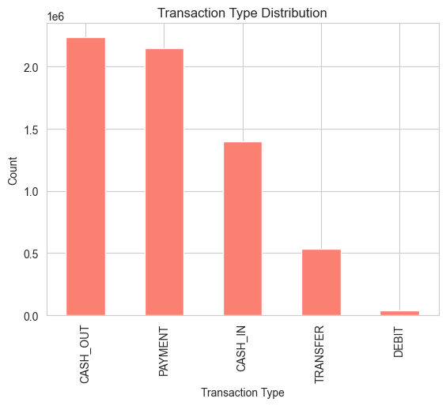
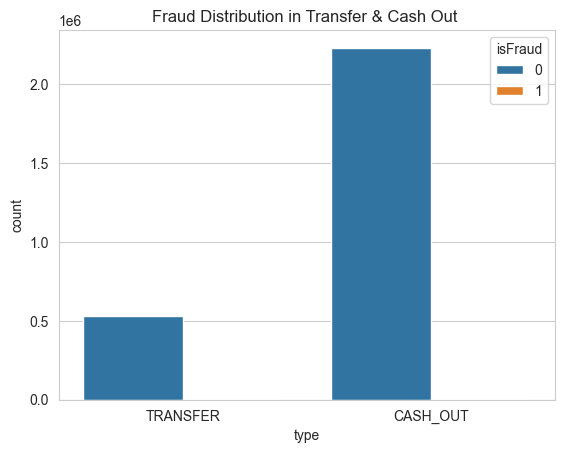
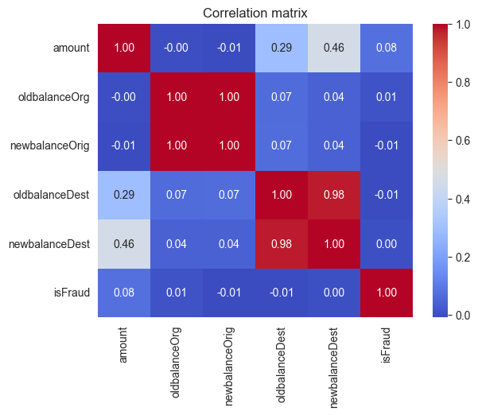
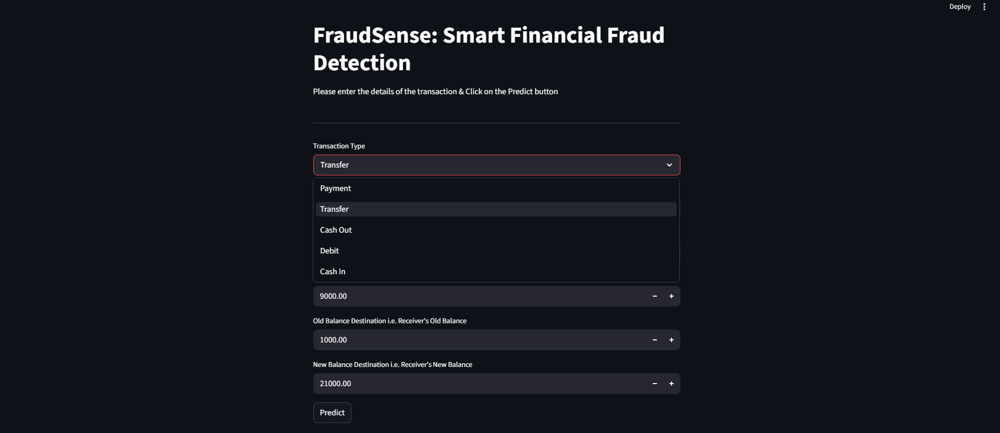
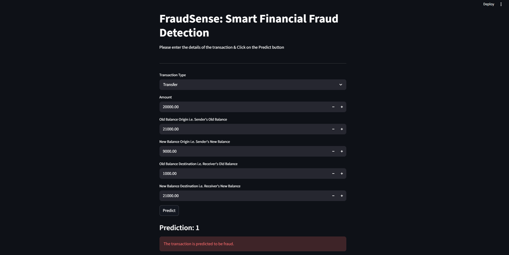

## End to End Financial Fraud Detection Project

 # FraudSense: Smart Financial Fraud Detection

 # Fraud Detection ML 🕵️‍♂️

An end-to-end Machine Learning project designed to identify and classify fraudulent transactions. This repository contains the complete workflow, from exploratory data analysis and model training to a deployable web application.

## 🌟 Project Overview

Financial fraud is a critical issue, and this project leverages Machine Learning to detect anomalous patterns in transaction data. The project is split into two main phases:
1. **Data Analysis & Modeling:** Exploring the data, handling imbalances, and training the predictive model.
2. **Application Deployment:** Providing an interactive interface to test the model with new data.

## 📂 Repository Structure

* `analysis.ipynb`: The Jupyter Notebook containing Exploratory Data Analysis (EDA), data preprocessing, feature engineering, and the training/evaluation of the Machine Learning model.
* `app.py`: The Python application script (e.g., Streamlit or Flask) that serves the trained model and provides a user interface for making predictions.
* `.gitignore`: Configured to exclude large datasets (`.csv`) and heavy model weight files (`.pkl`, `.h5`) from version control due to GitHub storage limits.

DataSet : (https://www.kaggle.com/datasets/amanalisiddiqui/fraud-detection-dataset?resource=download)

## 📊 Exploratory Data Analysis (EDA)

Understanding the underlying patterns in the transaction data was crucial for building an effective model. Below are key insights discovered during the EDA phase.

### 1. Transaction Type Distribution

* **Insight:** This graph breaks down the frequency of different transaction types in the dataset (e.g., Payment, Transfer, Cash Out, Cash In, Debit). It helps establish a baseline for normal user behavior.

### 2. Fraud in Transfers & Cash Outs

* **Insight:** By isolating specific transaction types, we discovered that fraudulent activities are almost exclusively concentrated within "Transfer" and "Cash Out" transactions. This was a critical feature for the model to learn.

### 3. Feature Correlation

* **Insight:** The correlation heatmap reveals how different numerical features relate to each other and to the target variable (`isFraud`). This helped in selecting the most impactful features and removing redundant data before training.

### Web App Interface



&


## 🛠️ Technologies Used

* **Language:** Python 3.x
* **Data Analysis & Manipulation:** Pandas, NumPy
* **Machine Learning:** Scikit-Learn 
* **Visualization:** Matplotlib, Seaborn
* **Web Framework:** Streamlit


## 🚀 How to Run Locally

```bash
1.  Clone the repository
git clone [https://github.com/Sh0hil/fraud_detection_ml.git](https://github.com/Sh0hil/fraud_detection_ml.git)
cd fraud_detection_ml


2. Set up a virtual environment (Recommended)
Bash
python -m venv venv
source venv/bin/activate  # On Windows use: venv\Scripts\activate

3. Install dependencies
(Make sure to create a requirements.txt file in your project!)
Bash
pip install -r requirements.txt

4. Run the Web App
Depending on the framework you used in app.py, run one of the following:


If using Streamlit:

Bash
streamlit run app.py


📈 Future Improvements
Test deep learning approaches (e.g., Neural Networks) for better accuracy.

Implement real-time data streaming and prediction.

Enhance the web app UI with detailed visual dashboards.


